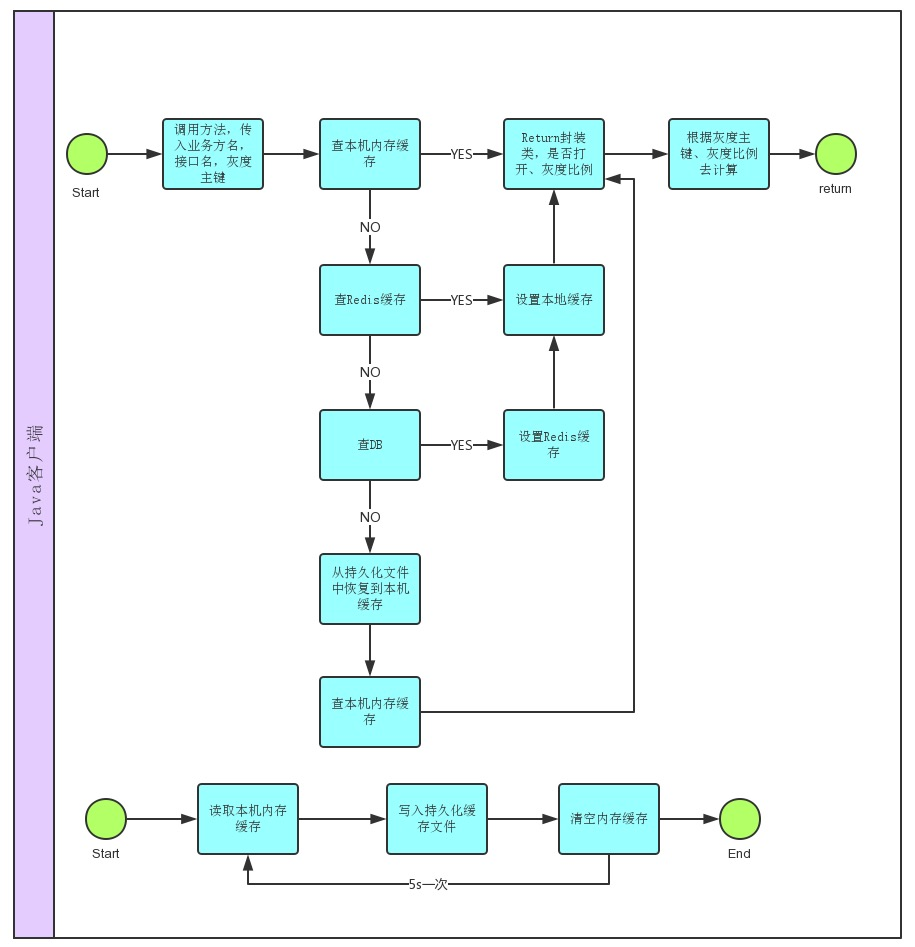

##通用灰度开关

###项目背景

   交易组内新代码发到线上通常要经过五大步骤：

* 第一，内部单元测试
* 第二，发布前代码审核
* 第三，线下测试机测试
* 第四，线上灰度测试
* 第五，灰度测试完毕后新代码完整发布上线
	
前四步中任何一步出现问题，都要找出问题修复代码，再重新进入发布流程。其中第四步线上灰度测试，涉及线上业务过程也复杂一些。

线上灰度测试分成两种情况：

* 第一，新代码在一定灰度比率内正常，继续提高灰度比率测试，并重发代码
* 第二，新代码在一定灰度比率内异常，代码回滚，修复新代码bug，再次进入重新发布流程

**这两种情况都有很大不足**：

* ######无论代码是否正常，提高灰度比率都需要重新发布。这对代码正常的情况是不合理的；
* ######新代码出现问题，要进行回滚操作，这段时间业务处于不可用状态，影响业务的正常运行。

随着新业务的不断上线，出现问题也在所难免。如何减少因以上问题造成对业务的影响，提高发布效率，减少异常处理时间，让研发同学把更多精力放在开发上，已成为亟待解决的问题。

- - -

###项目介绍

**通用灰度开关系统为业务接入方提供灵活、稳定、高可用的灰度开关服务。支持从业务到方法级别灰度开关的灵活控制；系统接入方便，接口稳定；提供99.999%的高可用性，全年故障时间在5分钟以内。**

系统可减少不必要的发布次数，缩短异常情况对业务的影响时间。当新业务正常时，提高灰度比率时代码无需重发；异常时，无需回滚代码，即可让业务逻辑在5s后切换至旧逻辑，对业务的影响时间缩短至5s。

####系统架构

######设计思路

为满足高可用性，必须保证服务自身的稳定性，即使服务自身出现问题对调用方也不会产生影响。

业务的灰度比率及开关状态信息持久化在DB中，使用Redis缓存拦截大部分查询请求，减轻DB压力。只要DB中无变化，Redis中的状态就是有效的。更新DB时才会过期Redis中业务的灰度比率及开关状态。

实际应用中，业务的灰度比率及开关状态的变更不会太频繁，长时间处于不变状态。为节省业务每次都到Redis查询的网络传输时间，在业务调用本地加上缓存，使大部分缓存落在本地。但是，这会带来所有请求都落在本地缓存，导致灰度比率及开关状态的变化时业务无法感知到的问题。

为解决这个问题，我们采用每5s清空一次本地缓存的方式，让5s内的查询落在本地，5s后的查询将会落到Redis。如此循环，将Redis查询缩短到5s一次，节省大量的网络传输时间。

但是还存在一个问题，如果Redis和DB都挂了，5s后本地缓存也被清空，业务查询状态时将会失败，导致业务异常。

我们采取的方式是，清空本地之前先持久化本地缓存。当Redis和DB都挂掉的时候，从本地持久化文件中恢复业务状态，将业务的灰度比率及开关状态恢复到最后一次时候的值，保证业务在此情况下依然可以正常运行。

######设计优点

* 降低了系统间的耦合：管理后台更新业务的的灰度比率及开关状态时，无需与Java和Tesla服务交互。更新的效果由各个客户端自行感知，当本地和Redis都查询不到时，会自行查DB获得最新状态；

* 缩短异常处理时间：DB更新后会过期Redis，客户端每5s清空一次本地缓存，再次查询业务状态时本地和Redis都会失败，此时会去DB中查询最新状态，并用于业务的状态判断。当新业务异常时，关闭开关或者调低灰度比率到0，即可让业务在5s内进入旧逻辑；

* 减轻DB和Redis压力：大部分查询落到本地；其次是Redis，5s才会查一次；DB最少，只有业务状态变更时才会查询。

######系统组成

系统可以为Java和Php提供开关服务,由以下几个部分组成,下图为开关系统的架构图：

* Java客户端：Java服务接入时需要引入依赖包，称为Java客户端。客户端会给业务提供状态查询结果，缓存和查询过程对上层的接入业务透明；

* Php业务接入方：接入时需要使用Php客户端和开关的Tesla服务，Php接入方不与Redis和DB交互；

* 开关业务Tesla服务：Php无法直接使用开关服务，通过请求开关业务Tesla服务获取业务状态的；

* 管理后台：提供业务注册、查询和管理的入口；

* DB和Redis：DB持久化业务开关状态，Redis作为缓存。

####工作流程图

#####管理后台业务流程

管理后台可为每个用户提供单独的业务注册和管理服务，各个用户间和业务间都是相互隔离，互不影响。

业务包括主业务和子业务。主业务的范围较大，可以是一个项目，子业务属于主业务，可以是小点的业务甚至可以是一个方法。通过管理后台可以管理每个子业务的开关状态，通过灰度值控制每个子业务的流量。此外，后台提供一些方便的操作，例如一键关闭功能，可以关闭主业务下的所有子业务，提高业务异常时的处理速度；一键灰度比率功能，可设置所有子业务的灰度比率。下图为管理业务状态流程图：

#####Java客户端

查询过程是，先查询本地是否缓存，存在即返回；否则去Redis中查询，查询成功会设置本地缓存，然后返回；否则去DB中查询，成功后设置本地和Redis，然后返回。
另外，还有后台线程池每5s清空一次本地缓存，清空之前先进行持久化操作。下图为Java客户端的操作流程图：

#####Php客户端

Php端工作原理与Java客户端类似。不同的地方有两处：

* 用Apc作为本地缓存，Apc缓存可以设置过期时间，不需使用后台线程去定期清空；
* Apc过期后，需通过Tesla服务获得Redis和DB中的状态，而无法直接查询Redis和DB状态。

- - -

####使用方法

#####管理后台

注册业务时，需要同时注册主业务和子业务的名称，下图显示的是名为snapshot的主业务名称，点击设置状态可管理业务。

下图显示的是snapshot主业务下的所有子业务信息，包括子业务名、创建和修改时间、开关状态以及灰度值设置，还提供了一键关闭和整体灰度设置的操作。

#####客户端接入

Java和Php接入都需要引入客户端，Php还需订阅Tesla服务。
目前，Tesla服务已经部署在两台服务器上。随需求增加，可以随时扩容。

- - -

####接入的项目

#####已经接入

* 分库分表项目

* 快照拆分项目
 
* 退款服务化项目正在使用

目前开关服务运行正常，服务稳定，未出现任何异常情况。

#####后续接入

* 物流
* 购物车
* 下单
* 用户DB分拆

- - -

####后续计划

* 管理后台的优化
* Java版本的服务化

- - -

####参与人员
	后端：大勇，九如
	技术指导：七公
	前端：南烛

